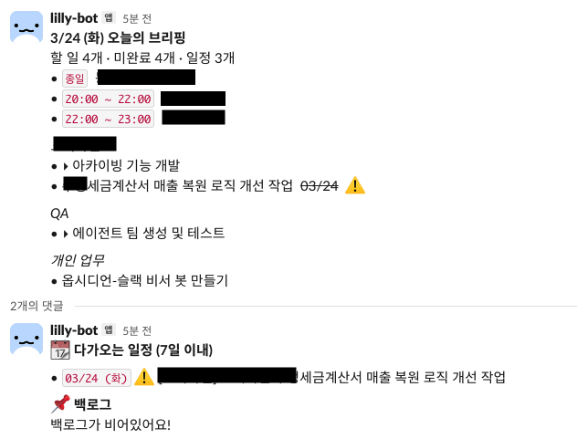
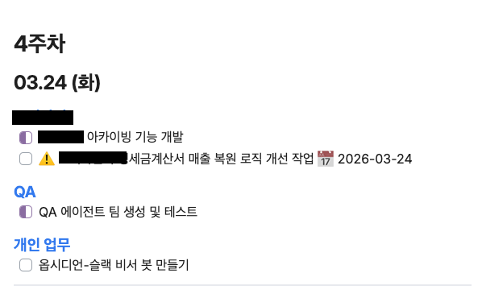
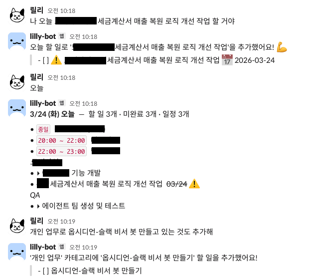

# Personal Slack Assistant

Slack DM으로 할 일을 관리하고, 매일 아침 브리핑을 보내주는 개인 비서 봇입니다.
[Obsidian](https://obsidian.md/) + macOS 캘린더 + Claude AI 기반.

> macOS 전용

**🇺🇸 [English README](README.md)**

**Slack 브리핑**



**Obsidian 저장 형태**



**Slack 자연어 대화**



---

## 할 수 있는 것들

| 말하면 | 동작 |
|--------|------|
| `오늘 할 일 뭐야?` | 오늘 태스크 + 캘린더 일정 |
| `내일 할 일` | 내일 태스크 + 캘린더 일정 |
| `이번 주 일정 알려줘` | 주간 일정 |
| `내일까지 보고서 제출해야 해` | 마감일 태스크 추가 |
| `13시 30분에 팀 미팅 있어` | 일정 추가 |
| `나중에 리팩토링 해야해` | 백로그 추가 |
| `API 개발 완료했어` | 완료 처리 |
| `오늘 API 개발 완료했고, 회의는 취소됐어` | 여러 태스크 한꺼번에 기록 |
| `오늘 한 일 정리해줘` | AI 요약 |
| `캘린더 설정: 개인, 회사` | 보여줄 캘린더 선택 |

매일 오전 7시에 자동 브리핑 (오늘 할 일 + 다가오는 마감 + 백로그)

---

## 시작하기

### 준비물

- macOS
- [Obsidian](https://obsidian.md/) 설치 및 볼트 생성
- [Anthropic API Key](https://console.anthropic.com/) (Claude 사용)
- Slack 워크스페이스

---

### 1단계 — Slack 앱 만들기

1. [api.slack.com/apps](https://api.slack.com/apps) → **Create New App** → **From scratch**
2. 앱 이름 입력 후 워크스페이스 선택
3. 왼쪽 메뉴 **Socket Mode** → 활성화 → 토큰 이름 입력 후 **Generate** → `xapp-...` 토큰 복사
4. 왼쪽 메뉴 **OAuth & Permissions** → **Bot Token Scopes** → 아래 4개 추가:
   - `chat:write` / `im:history` / `im:read` / `im:write`
5. 같은 페이지 상단 **Install to Workspace** → **Allow** → `xoxb-...` 토큰 복사
6. 왼쪽 메뉴 **Event Subscriptions** → 활성화 → **Subscribe to bot events** → `message.im` 추가 → **Save**

---

### 2단계 — 봇 설치

**터미널 여는 법**: `Cmd + Space` → "터미널" 입력 → Enter

아래 명령어를 터미널에 한 줄씩 붙여넣고 Enter:

```bash
git clone https://github.com/kdelay/obsidian-slack-assistant
cd obsidian-slack-assistant
python -m venv .venv
source .venv/bin/activate
pip install -e .
```

---

### 3단계 — 환경변수 설정

터미널에서 실행:
```bash
cp .env.example .env
open .env
```

텍스트 편집기로 파일이 열리면 아래 값을 채웁니다:

| 항목 | 설명 |
|------|------|
| `SLACK_BOT_TOKEN` | 1단계 5번에서 복사한 `xoxb-...` |
| `SLACK_APP_TOKEN` | 1단계 3번에서 복사한 `xapp-...` |
| `ANTHROPIC_API_KEY` | [console.anthropic.com](https://console.anthropic.com/) |
| `OBSIDIAN_VAULT` | Obsidian 볼트 폴더 경로 (예: `/Users/yourname/Documents/Obsidian`) |
| `SLACK_CHANNEL_ID` | 아직 모름 → 4단계 이후 채우기 |

---

### 4단계 — 봇 실행 및 채널 ID 확인

```bash
python main.py
```

실행 후 Slack에서 봇에게 DM을 한 번 보냅니다.

그 다음 Slack에서 봇과의 DM 화면 URL을 확인합니다:
```
https://app.slack.com/client/TXXXXXXXX/D012AB3CD4E
                                        ↑ 이 부분이 SLACK_CHANNEL_ID
```

`.env`의 `SLACK_CHANNEL_ID`에 입력 후 봇을 재시작합니다.

---

### 5단계 — 캘린더 연동 (선택)

캘린더 일정도 함께 보고 싶다면:

**Google 캘린더**
> 시스템 설정 → 인터넷 계정 → 계정 추가 → Google → 캘린더 활성화

**캘린더 접근 권한**
> macOS 캘린더 앱 → 설정 → 계정 → Google 계정 선택 → 위임에서 체크

이후 Slack에서 보여줄 캘린더를 선택합니다:
```
캘린더 목록              ← 연결된 캘린더 확인
캘린더 설정: 개인, 회사  ← 보여줄 캘린더 지정
```

---

### 6단계 — 부팅 시 자동 실행 (선택)

Mac이 켜질 때 봇이 자동으로 시작되게 하려면 아래 파일을 만듭니다:

`~/Library/LaunchAgents/com.yourname.personal-assistant.plist`

```xml
<?xml version="1.0" encoding="UTF-8"?>
<!DOCTYPE plist PUBLIC "-//Apple//DTD PLIST 1.0//EN" "http://www.apple.com/DTDs/PropertyList-1.0.dtd">
<plist version="1.0">
<dict>
    <key>Label</key>
    <string>com.yourname.personal-assistant</string>
    <key>ProgramArguments</key>
    <array>
        <string>/절대경로/.venv/bin/python</string>
        <string>/절대경로/personal-assistant/main.py</string>
    </array>
    <key>WorkingDirectory</key>
    <string>/절대경로/personal-assistant</string>
    <key>RunAtLoad</key><true/>
    <key>KeepAlive</key><true/>
    <key>StandardOutPath</key>
    <string>/tmp/personal-assistant.log</string>
    <key>StandardErrorPath</key>
    <string>/tmp/personal-assistant-error.log</string>
</dict>
</plist>
```

```bash
launchctl load ~/Library/LaunchAgents/com.yourname.personal-assistant.plist
```

---

## Obsidian 파일 포맷

봇은 `Todo/YYYY년/M월.md` 파일을 자동으로 생성하고 관리합니다.

```markdown
## 03.24 (화)
### 개발
- [ ] 코드 리뷰                          ← 대기
- [/] API 개발                           ← 진행 중 (다음 날 자동 이월)
- [x] 버그 수정 완료 📅 2026-03-24       ← 완료 + 마감일
- [-] 회의                               ← 취소
```

백로그는 `Todo/Backlog.md`에 저장됩니다.

---

## 기술 스택

- [Slack Bolt](https://github.com/slackapi/bolt-python) — Socket Mode (서버 불필요)
- [Anthropic Claude](https://anthropic.com/) — 자연어 의도 파악
- [EventKit](https://developer.apple.com/documentation/eventkit) via pyobjc — macOS 캘린더
- [APScheduler](https://apscheduler.readthedocs.io/) — 매일 오전 브리핑

---

## License

MIT
